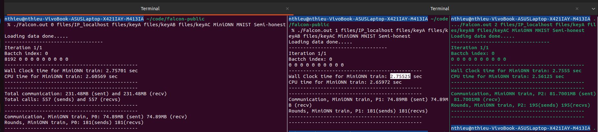
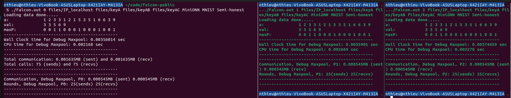

# Hướng dẫn traning model với falcon

## Mục lục
- [Cơ chế hoạt động của ppml](#cơ-chế-hoạt-động-của-ppml)
- [Giai đoạn chuẩn bị](#chuẩn-bị)
    - [Cài đặt môi trường tương ứng](#môi-trường-chạy)
    - [Dataset - MNIST](#chuẩn-bị-dữ-liệu---mnist)
    - [Thiết lập thông số](#điều-chỉnh-thông-số-của-mô-hình-ml)
- [Huấn luyện mô hình](#training)
- [Kết quả](#kết-quả)
- [Nhận xét - đánh giá](#nhận-xét---đánh-giá)
- [Phụ Lục](#phụ-lục)

## Cơ chế hoạt động của ppml
- Sử dụng fixed point value để lưu trữ các giá trị tính toán - `FLOAT_PRECISION` trong file `src/globals.h`
- Sau khi chuyển giá trị dưới kiểu `int`, `float` sang dạng `fixed point value`, các protocol bên trong ppml sẽ coi các giá trị đó đơn thuần là 1 chuốt các bit và áp dụng các phép toán `+`, `&`, `^` để ra chuỗi bit tương ứng, khi cần sẽ reconstruct lại giá trị `int`, `float` như ban đầu để đạt được kết quả cùng tính toán nhằm đảo bảo tính bảo mật xuyên xuốt quá trình thực thi

## Chuẩn bị

### Môi trường chạy
- Yêu cầu cài đặt các hàm thư viện sau:
    - [g++]()
    - [make]()
    - [libssl-dev]()

### Chuẩn bị dữ liệu - MNIST
- Sử dụng script tại `MNIST/run.sh` để tạo các file data cho từng bên tham gia với nguồn (.csv file tương ứng)
- Chỉnh sửa đường dẫn để load data tại hàm `loadData` trong file `src/secondary.cpp`

### Điều chỉnh thông số của mô hình machine learning
- Điều chỉnh số lượng image trainnig và testing tại hàm `loadData` trong file `src/secondary.cpp`
- Điều chỉnh fixed point và số lượng epoch: `src/globals.h`

### Tự điều chỉnh các layer bên trong một mô hình
- Có thể thêm mới, sửa các layer có sẵn tại hàm `selectNetwork` tròn file `src/secondary.cpp`
- Xác định yêu cầu chuẩn hóa dữ liệu, với biến `WITH_NORMALIZATION` thiết lập trong hàm `selectNetwork`, tuy nhiên `WITH_NORMALIZATION` trong toàn bộ project chỉ thiết lập cho hàm tính toán accuracy.

## Training model
- build toàn bộ project với lệnh `make all -j$(nproc)`

- Training local
    - `Cách thức train`: sử dụng 3 terminal riêng biệt và chạy các lệnh tương ứng trên từng terminal
    - `Lựa chọn mô hình`: Có thể thay đổi mô hình từ `MiniONN` sang `SecureML`, `Sarda`, `LeNet` cũng như các mô hình có thể tự thêm vào.
    ```
    ./Falcon.out 0 files/IP_localhost files/keyA files/keyAB files/keyAC MiniONN MNIST Semi-honest
    ./Falcon.out 1 files/IP_localhost files/keyA files/keyAB files/keyAC MiniONN MNIST Semi-honest
    ./Falcon.out 2 files/IP_localhost files/keyA files/keyAB files/keyAC MiniONN MNIST Semi-honest
    ```
    - Hình ảnh mô phỏng một quá trình train với `2^11`  ảnh và `24` epoch

    - `Accuracy`: Khi thực hiện không tiệm cận được như accuracy được nêu bên trong [paper gốc]()
    - `Thời gian`: Thời gian training cho một batchsize gồm `128 images`, một image tương đương một ma trận `28x28`


- Training global (Chưa thực hiện)

## Kết quả
- Thời gian thực thi cho từng batch size (`128 images`/`1 batch`,`28x28`/`1 image`) trong quá trình trainnig bao gồm `forward` và `backward` ~ `2.7555 second`

## Nhận xét - đánh giá
- Dưới dữ liệu đầu vào là giá trị `int` của bộ ảnh MNIST khi chưa chuẩn hóa cho ra accuracy không thể áp dụng vào thực tế . 
- Có thể xem xét, áp dụng phương pháp chuẩn hóa dữ liệu cho bộ ảnh đầu vào, dựa vào gợi ý tại `files\preload\input_0` (format input của mô hình với preload khác so với input từ tập ảnh MNIST được tạo ra tại `MNIST/run.sh`)
- Thời gian chạy 50 batch với một số models

| ML model | Times - fixed point value - semi-honet - Falcon | communications - sending and receving | cpu - colab
| :---:   | :---: | :---: | :---: |
| [MinioNN](./images/MinioNN.png) | ~146 s | 3744.5 MB | ---- |
| [LeNet](./images/LeNet.png) | ~570 s | 5577.61 MB | [~540 ms](https://github.com/trhieung/CSC14120/blob/main/report_run.ipynb) |

# Phụ Lục

## Các protocol thiết lập bên trong Framework
Nhằm hỗ trợ cho training và inferencing và tuân thủ mộ mô hình ppml, falcon cài đặt một số giao thức an toàn (thông tin cụ thể được nêu trong luận văn + [paper gốc]())
- Cách kiểm tra riêng lẻ từng protocol: chọn protocol tương ứng được liệt kê trong hàm `runTest` tại file `src/unitTests.cpp`, uncomment dòng debug trong main và đưa tên protocol tương ứng vào hàm.
    - `Mat-Mul`
    - `DotProd`
    - `PrivateCompare`
    - `Wrap`
    - `ReLUPrime`
    - `ReLU`: 
    - `Division`
    - `BN`
    - `SS Bits`
    - `SelectShares`
    - `Maxpool`

- `Ví dụ `với `Maxpooling`, xác định vị trí có giá trị lớn nhất trong một hàng, đồng thời chỉ ra giá trị đó



<div style="display: flex">

  <div style="width: 30%; text-align: center;">

| col 0 | col 1 | col 2 |
|:-------:|:-------:|:-------:|
| 1<br>3<br>1<br>5<br>6 | 2<br>1<br>5<br>1<br>3 | 3<br>2<br>3<br>6<br>9 |
  </div>
  <div style="width: 30%; color = black; text-align: center;">

*giá trị lớn nhất trong hàng*

        3
        3
        5
        6
        9
  </div>
  <div style="width: 30%; color = black; text-align: center;">
  
*Ma trận biểu thị ví trí lớn nhất*

        0 0 1
        1 0 0
        0 1 0
        0 0 1
        0 0 1
  </div>
</div
<br>
